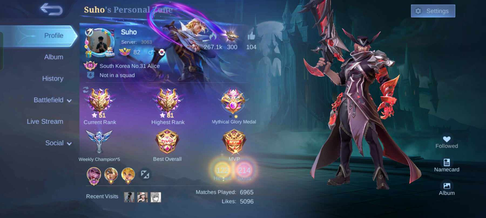
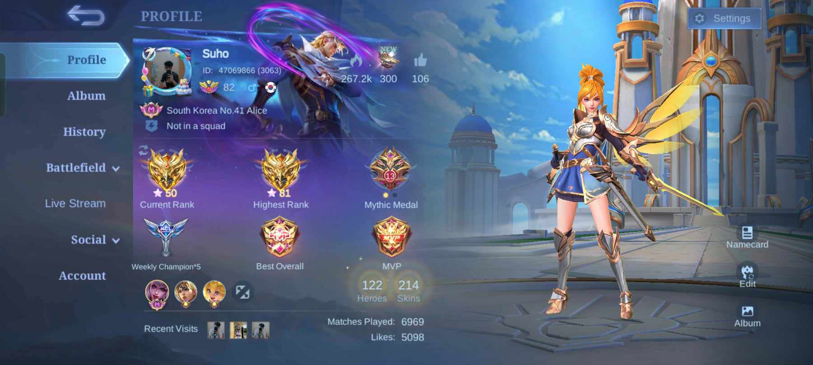
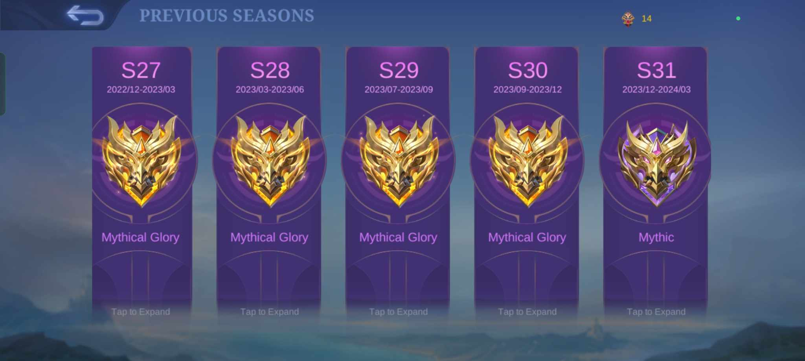
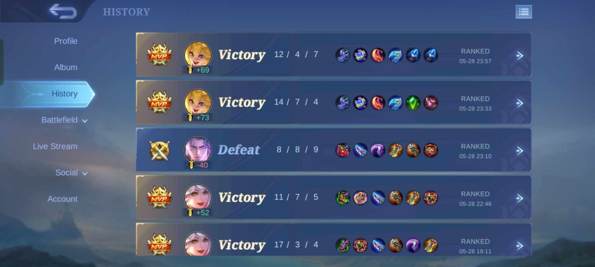
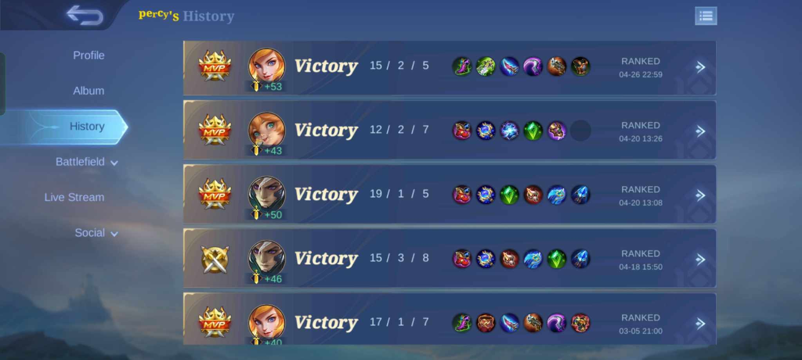
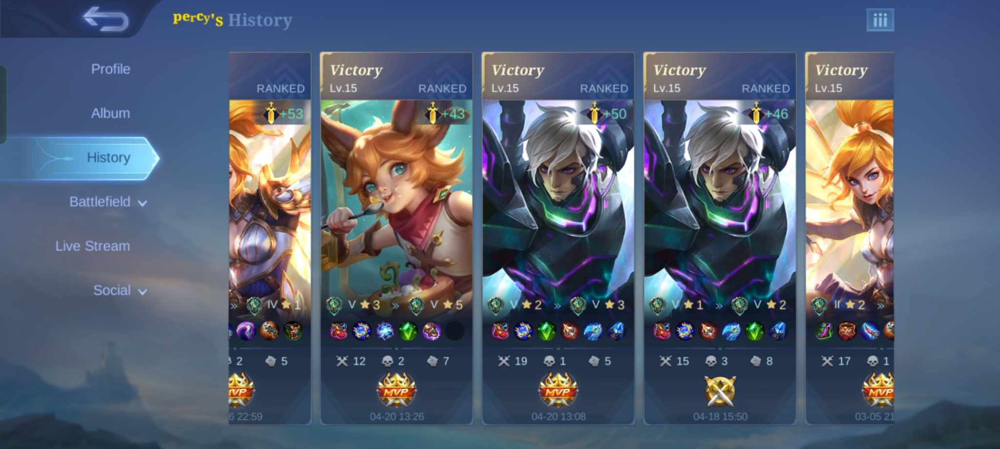

# Gaming Portfolio Abdul

This is a simple gaming portfolio created by Abdul, showcasing his passion for gaming, particularly Mobile Legends and Call of Duty Mobile (CODM).

## About Me

I am passionate about the world of gaming and its potential for storytelling and immersive experiences. My love for gaming extends beyond just playing; I find myself drawn to the intricacies of game design and the art of creating captivating virtual worlds.

I enjoy playing a variety of online games, with my favorites being Mobile Legends and Call of Duty Mobile (CODM). Whether I'm coordinating with my team in a fierce battle or exploring new strategies to outsmart opponents, gaming is a significant part of my life.

Besides being a gamer, I also love to stay updated with the latest in gaming technology and trends. I believe that gaming is more than just a hobby; it’s a way to connect with people globally, share experiences, and challenge oneself.

When I'm not gaming, I enjoy watching esports tournaments, reading about game development, and engaging with the gaming community through various forums and social media platforms.

## Mobile Legends Portfolio

### Username: Suho
- **Rank:** Mythic Glory
- **Heroes Mastered:** 50+
- **Matches Played:** 10k+
- **Win Rate:** 64%
- **Favorite Role:** Assassin
- **Favorite Hero:** Fanny

## Screenshots

## Code Source and Template

I obtained the template for this portfolio from a Google search for gaming portfolio templates. The HTML and CSS code used in this project is based on the template I found online.
## Credits

- Template Source:https://codepen.io/search/pens?q=gaming
